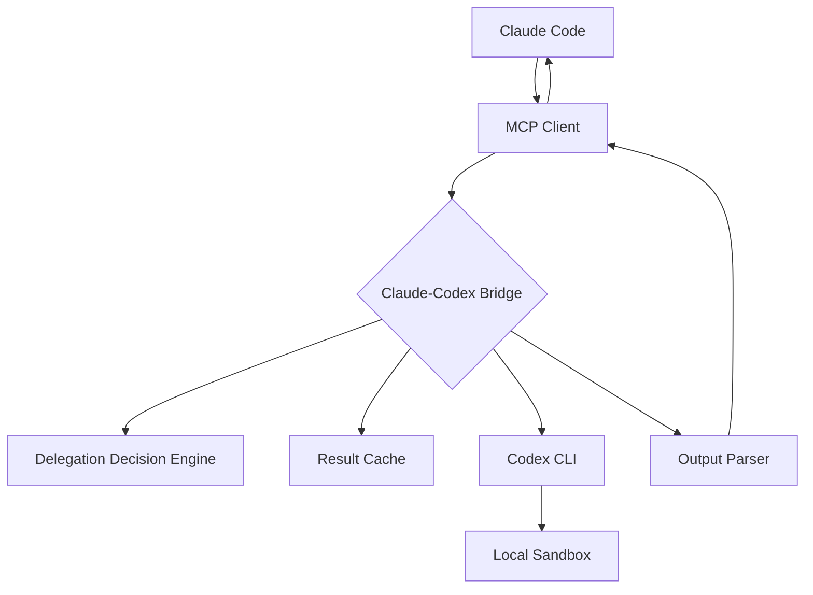

# Claude-Codex Bridge

An intelligent **MCP (Model Context Protocol) server** for orchestrating task delegation between Claude and OpenAI Codex CLI.

## Project Overview

Claude-Codex Bridge is an **Agentic Bridge** that intelligently delegates coding tasks from Claude Code to locally running OpenAI Codex CLI. Rather than a simple request forwarder, it's an intelligent orchestration system with decision-making capabilities, featuring result caching and security validation.

## Core Features

### 🚀 Intelligent Task Delegation
- **Automatic Task Routing**: Intelligently analyzes tasks and decides whether to delegate to Codex CLI
- **Working Directory Management**: Secure working directory validation and file access control
- **Execution Mode Control**: Supports multiple execution and sandbox modes for different security requirements

### 🧠 Intelligent Processing
- **Context Enhancement**: Intelligent context generation and file content management
- **Error Handling**: Comprehensive error handling and fallback mechanisms

### ⚡ Performance Optimization
- **Intelligent Caching**: File content hash-based result caching system
- **Concurrency Control**: Asynchronous execution and timeout management
- **Resource Management**: LRU cache strategy and automatic cleanup mechanisms

### 🛡️ Security Assurance
- **Path Validation**: Strict working directory validation to prevent path traversal attacks
- **Sandbox Isolation**: Supports multiple sandbox modes to restrict filesystem access
- **Permission Control**: Fine-grained execution permission management

## Technical Architecture



### Component Overview

1. **MCP Server**: High-performance server based on FastMCP, providing standardized tool interfaces
2. **Delegation Decision Engine (DDE)**: Intelligently analyzes tasks and determines optimal execution strategies
3. **Result Cache**: Intelligent caching system based on content hashes, avoiding duplicate executions
4. **Output Parser**: Intelligently identifies and formats Codex output into structured data

## Quick Start

### Prerequisites

1. **Python 3.11+**
2. **uv Package Manager**: `curl -LsSf https://astral.sh/uv/install.sh | sh`
3. **OpenAI Codex CLI**: `npm install -g @openai/codex`

### Installation

#### From PyPI (Recommended)

```bash
pip install claude-codex-bridge
```

#### From Source

1. **Clone the project**
   ```bash
   git clone https://github.com/xiaocang/claude-codex-bridge.git 
   cd claude-codex-bridge
   ```

2. **Install dependencies**
   ```bash
   uv sync
   ```

   Or with pip:
   ```bash
   pip install -e .
   ```

3. **Configure environment variables** (optional)
   ```bash
   # Copy environment variable template
   cp .env.example .env

   # Edit .env file, add API keys
   vim .env
   ```

4. **Start the server**
   
   If installed from PyPI:
   ```bash
   claude-codex-bridge
   ```
   
   Or if running from source:
   ```bash
   uv run python -m claude_codex_bridge
   ```
   
   Or directly:
   ```bash
   uv run src/claude_codex_bridge/bridge_server.py
   ```

### Claude Code Integration

1. **Configure MCP Server**
   
   If installed from PyPI:
   ```bash
   # In your project directory
   claude mcp add codex-bridge --command "claude-codex-bridge" --scope project
   ```
   
   Or if running from source:
   ```bash
   # In your project directory
   claude mcp add codex-bridge --command "python -m claude_codex_bridge" --scope project
   ```

2. **Use Tools**
   ```
   /mcp__codex-bridge__codex_delegate "Refactor main.py file to use async/await syntax" --working_directory "/path/to/your/project"
   ```

## Main Tools

### `codex_delegate`

Core task delegation tool that delegates coding tasks to Codex CLI.

**Parameters**:
- `task_description` (required): Natural language description of the task
- `working_directory` (required): Absolute path to the project working directory
- `execution_mode` (optional): Execution mode (untrusted/on-failure/on-request/never)
- `sandbox_mode` (optional): Sandbox mode (read-only/workspace-write/danger-full-access)
- `output_format` (optional): Output format (diff/full_file/explanation)

**Example**:
```json
{
  "task_description": "Add email validation method to User class",
  "working_directory": "/Users/username/my-project",
  "execution_mode": "on-failure",
  "sandbox_mode": "workspace-write",
  "output_format": "diff"
}
```

### `cache_stats`

Get cache statistics and clean up expired entries.

### `clear_cache`

Clear all cache entries.

## Configuration Options

### Environment Variables

```bash
# Cache configuration
CACHE_TTL=3600          # Cache TTL in seconds
MAX_CACHE_SIZE=100      # Maximum cache entries
```

### Execution Mode Explanation

- **untrusted**: Only runs trusted commands, most secure
- **on-failure**: Requests approval on failure, recommended for most tasks
- **on-request**: Model decides when to request approval, suitable for complex tasks
- **never**: Never requests approval, suitable for simple automation tasks

### Sandbox Mode Explanation

- **read-only**: Read-only access, suitable for code analysis and explanation
- **workspace-write**: Writable workspace, suitable for most development tasks
- **danger-full-access**: Full access, use with caution

## Development and Testing

### Running Tests

```bash
# Run all tests
uv run python -m pytest tests/

# Run specific tests
uv run python -m pytest tests/test_engine.py
uv run python -m pytest tests/test_cache.py
```

### Development Mode

```bash
# Debug with MCP Inspector
uv run mcp dev src/claude_codex_bridge/bridge_server.py
# Or if installed
mcp dev claude-codex-bridge
```

### Code Quality

```bash
# Code formatting
uv run black src/ tests/

# Type checking
uv run mypy src/

# Code linting
uv run flake8 src/ tests/
```

## Project Structure

```
claude-codex-bridge/
├── src/
│   └── claude_codex_bridge/
│       ├── __init__.py       # Package initialization
│       ├── __main__.py       # Entry point
│       ├── bridge_server.py # Main MCP server
│       ├── engine.py        # Delegation Decision Engine
│       └── cache.py         # Result caching system
├── tests/
│   ├── test_engine.py     # Engine unit tests
│   └── test_cache.py      # Cache unit tests
├── .env                   # Environment configuration
├── .mcp.json             # MCP client configuration example
├── pyproject.toml        # Project configuration
└── README.md            # Project documentation
```

## Best Practices

### Writing Task Descriptions

✅ **Good task descriptions**:
- "Add a validate_email method to the User class to validate email format"
- "Refactor all authentication-related functions in src/auth.py file to use async/await"
- "Add boundary condition and exception handling tests for the calculate_tax function"

❌ **Avoid these descriptions**:
- "Improve the code"
- "Fix all issues"
- "Add new features"

### Security Recommendations

1. Use absolute paths to specify working directory
2. Use `read-only` sandbox mode for production environments
3. Regularly clean cache and log files
4. Monitor system resource usage

## Troubleshooting

### Common Issues

**Q: Codex CLI not found**
```
A: Make sure it's installed: npm install -g @openai/codex
```

**Q: Working directory validation failed**
```
A: Check that the directory path is absolute and exists
```

**Q: Cache miss**
```
A: File content changes invalidate cache, this is normal behavior
```

## Performance Optimization Tips

1. **Enable caching**: Set appropriate TTL and cache size
2. **Reasonable timeouts**: Set timeout based on task complexity
3. **Regular cleanup**: Use `clear_cache` tool to clean unused cache

## Version History

### v0.1.0
- ✅ Basic MCP server implementation
- ✅ Codex CLI integration
- ✅ Delegation Decision Engine
- ✅ Result caching system
- ✅ Security validation mechanism

## License

MIT License - see [LICENSE](LICENSE) file for details

## Support

For questions or suggestions, please create a GitHub Issue or contact the maintainers.

---

**Claude-Codex Bridge** - Making AI agent collaboration smarter 🚀
