# Claude-Codex Bridge

An intelligent **MCP (Model Context Protocol) server** that leverages Codex's exceptional capabilities in **code analysis, architectural planning, and complex problem-solving**.

## Screenshots


## Philosophy: Think First, Execute Later

Claude-Codex Bridge embraces a **planning-first approach** to software development. Codex's true strength lies not in blindly executing changes, but in:

- 🧠 **Deep Understanding**: Comprehending complex code relationships and patterns
- 📊 **Strategic Analysis**: Identifying optimization opportunities and architectural insights
- 🎯 **Thoughtful Planning**: Designing robust, well-considered solutions
- ✅ **Quality Assurance**: Reviewing code for best practices, security, and performance

### Why Read-Only by Default?

1. **Safety First**: Prevent accidental modifications during code exploration
2. **Better Decisions**: Encourage thorough analysis before making changes
3. **Learning Tool**: Understand the "why" behind recommendations, not just the "what"
4. **Audit Trail**: Clear separation between planning and execution phases

### Recommended Development Flow

```mermaid
graph LR
    A[🔍 Analyze] --> B[🧠 Understand]
    B --> C[📋 Plan]
    C --> D[👁️ Review]
    D --> E[⚡ Execute With Claude Code]
    E --> F[✅ Validate]
```



1. **Analyze**: Use read-only mode to deeply understand your codebase
2. **Understand**: Let Codex explain complex relationships and patterns
3. **Plan**: Design comprehensive solutions and strategies
4. **Review**: Examine Codex's recommendations carefully
5. **Execute**: Enable write mode and apply changes thoughtfully using Claude Code
6. **Validate**: Test and verify the implemented changes

## Project Overview

Claude-Codex Bridge is an **Intelligent Analysis Engine** that orchestrates task delegation between Claude Code and locally running OpenAI Codex CLI. Rather than a simple code generator, it's a sophisticated planning and analysis system with intelligent caching, security validation, and read-only safety defaults.

## Technical Architecture


### Component Overview

1. **MCP Server**: High-performance server based on FastMCP, providing standardized tool interfaces
2. **Delegation Decision Engine (DDE)**: Intelligently analyzes tasks and determines optimal execution strategies
3. **Result Cache**: Intelligent caching system based on content hashes, avoiding duplicate executions
4. **Output Parser**: Intelligently identifies and formats Codex output into structured data

## Quick Start

### Prerequisites

1. **Python 3.11+**
2. **OpenAI Codex CLI**: `npm install -g @openai/codex`

### Installation

#### From PyPI (Recommended)

```bash
pip install claude-codex-bridge
```

#### From Source

1. **uv Package Manager** (if building from source): `curl -LsSf https://astral.sh/uv/install.sh | sh`

2. **Clone the project**
   ```bash
   git clone https://github.com/xiaocang/claude-codex-bridge.git
   cd claude-codex-bridge
   ```

3. **Install dependencies**
   ```bash
   uv sync
   ```

   Or with pip:
   ```bash
   pip install -e .
   ```

4. **Configure environment variables** (optional)
   ```bash
   # Copy environment variable template
   cp .env.example .env

   # Edit .env file, add API keys
   vim .env
   ```

### Starting the Server

The server supports two operational modes:

#### 📋 Planning Mode (Default - Recommended)
Start in read-only mode for safe code analysis and planning:

**If installed from PyPI:**
```bash
claude-codex-bridge
```

**Or using Python module:**
```bash
python -m claude_codex_bridge
```

**If running from source:**
```bash
uv run python -m claude_codex_bridge
```

#### ⚡ Execution Mode (When Ready to Apply Changes)
Enable write operations when you're ready to implement Codex's recommendations:

**If installed from PyPI:**
```bash
claude-codex-bridge --allow-write
```

**Or using Python module:**
```bash
python -m claude_codex_bridge --allow-write
```

**If running from source:**
```bash
uv run python -m claude_codex_bridge --allow-write
```

#### Command-Line Options
- `--allow-write`: Enable file modification operations (default: read-only)
- `--verbose`: Enable verbose output for debugging

### Claude Code Integration

#### 1. Configure MCP Server
You can configure separate servers for planning and execution modes:

**Planning Mode (Default):**
```bash
# In your project directory - for safe analysis and planning
claude mcp add codex-planning --command "claude-codex-bridge" --scope project
```

**Execution Mode:**
```bash
# In your project directory - for applying changes
claude mcp add codex-execution --command "claude-codex-bridge --allow-write" --scope project
```

**Or use the example configuration file:**
```bash
# Copy the example configuration
cp .mcp.json.example .mcp.json
# Edit to match your setup
```

#### 2. Usage Examples

**Planning Phase (Read-Only):**
```
/mcp__codex-planning__codex_delegate "Analyze the authentication system for security vulnerabilities" --working_directory "/path/to/your/project"
```

**Execution Phase (Write-Enabled):**
```
/mcp__codex-execution__codex_delegate "Implement the security fixes we planned earlier" --working_directory "/path/to/your/project"
```

## Main Tools

### `codex_delegate`

Leverage Codex's advanced analytical capabilities for code comprehension and strategic planning.

**Codex Specializes In**:
- 🔍 Analyzing complex codebases and identifying improvement opportunities
- 🏗️ Designing architectural solutions and refactoring strategies
- 📋 Planning implementation approaches for new features
- 🧪 Generating comprehensive test strategies
- ⚡ Reviewing code for quality, security, and performance issues

**Parameters**:
- `task_description` (required): Describe what you want Codex to analyze or plan
- `working_directory` (required): Project directory to analyze
- `execution_mode` (optional): Approval strategy (default: on-failure)
- `sandbox_mode` (optional): File access mode (forced to read-only unless --allow-write)
- `output_format` (optional): How to format the analysis results (diff/full_file/explanation)

**Planning Mode Example**:
```json
{
  "task_description": "Analyze the user authentication system for security vulnerabilities and design improvement strategies",
  "working_directory": "/Users/username/my-project",
  "execution_mode": "on-failure",
  "sandbox_mode": "read-only",
  "output_format": "explanation"
}
```

**Execution Mode Example**:
```json
{
  "task_description": "Implement the security improvements we planned for the authentication system",
  "working_directory": "/Users/username/my-project",
  "execution_mode": "on-failure",
  "sandbox_mode": "workspace-write",
  "output_format": "diff"
}
```

### `cache_stats`

Get cache statistics and clean up expired entries.

### `clear_cache`

Clear all cache entries.

## Configuration Options

### Environment Variables

```bash
# Cache configuration
CACHE_TTL=3600          # Cache TTL in seconds
MAX_CACHE_SIZE=100      # Maximum cache entries
```

### Execution Mode Explanation

- **untrusted**: Only runs trusted commands, most secure
- **on-failure**: Requests approval on failure, recommended for most tasks
- **on-request**: Model decides when to request approval, suitable for complex tasks
- **never**: Never requests approval, suitable for simple automation tasks

### Sandbox Mode Explanation

- **read-only**: Read-only access, suitable for code analysis and explanation
- **workspace-write**: Writable workspace, suitable for most development tasks
- **danger-full-access**: Full access, use with caution

## Version History

### v0.1.1
- 🔄 Version update and maintenance release

### v0.1.0
- ✅ Basic MCP server implementation
- ✅ Codex CLI integration
- ✅ Delegation Decision Engine
- ✅ Result caching system
- ✅ Security validation mechanism

## License

MIT License - see [LICENSE](LICENSE) file for details

## Support

For questions or suggestions, please create a GitHub Issue or contact the maintainers.

---

**Claude-Codex Bridge** - Making AI agent collaboration smarter 🚀
